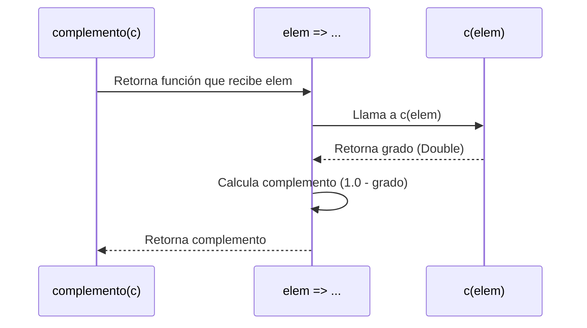

# Informe de proceso Algoritmo Complemento

  

## Definición del Algoritmo

  

```Scala
package taller

class  ConjuntosDifusos {
	type  ConjDifuso = Int => Double
	def  complemento(c: ConjDifuso): ConjDifuso = {
		elem => {
		val  grado = c(elem)
		val  complemento = 1.0 - grado
		complemento
		}
	}
}
```

  

El algoritmo **Complemento** en conjuntos difusos toma una función característica `c` que representa el grado de pertenencia de un elemento dentro del intervalo $[0, 1]$.

Devuelve una nueva función que representa el **complemento difuso**, definido matemáticamente como:

  

$$
f_{\neg S}(x) = 1 - f_S(x)
$$

  

---

  

## Explicación paso a paso

  

1.  **Entrada:** un conjunto difuso `c`, representado como una función `Int => Double`.

2.  **Operación:** para cada elemento entero del universo, se obtiene su grado de pertenencia `c(elem)`.

3.  **Transformación:** se aplica la fórmula del complemento, restando el grado obtenido de 1.

4.  **Salida:** se devuelve una nueva función que representa el conjunto complementario.

  

Ejemplo:

Si $f_S(5) = 0.8$, entonces $f_{\neg S}(5) = 1 - 0.8 = 0.2$.

  

---

  

## Llamados de pila en recursión

  

El algoritmo **no utiliza recursión**, ya que trabaja directamente con una función anónima (`lambda`) aplicada a cada elemento del conjunto.

Por tanto, no existe una pila de llamados significativa en este caso.

  

---

  

## Ejemplo de uso

  

```Scala
val  conjuntos = new  ConjuntosDifusos()
// Definimos un conjunto difuso simple
val  conjuntoEjemplo: conjuntos.ConjDifuso = x => if (x <= 5) 0.3  else  0.8
// Calculamos su complemento
val  complemento = conjuntos.complemento(conjuntoEjemplo)
println(complemento(4)) // 1 - 0.3 = 0.7
println(complemento(7)) // 1 - 0.8 = 0.2
```

  

Resultado esperado:

```
0.7
0.2
```

  

---

  

## Diagrama de llamados de pila

  



  

---

  

## Análisis de complejidad

  

El algoritmo **Complemento** evalúa una sola operación aritmética por cada elemento del conjunto difuso, sin estructuras recursivas ni ciclos.

Por tanto, su complejidad temporal es:

$$
O(1)
$$

La complejidad espacial también es $O(1)$, ya que no se almacenan estructuras adicionales y solo se devuelve una nueva función.