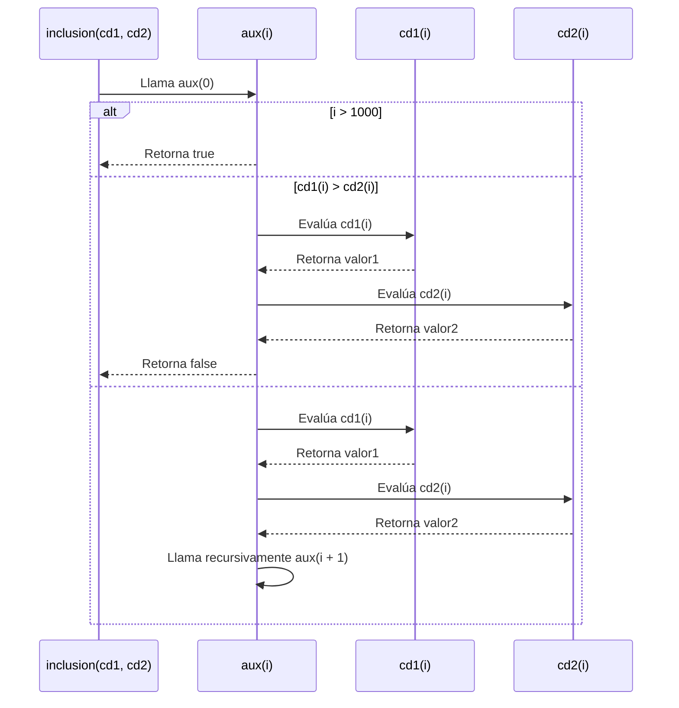

  

---

# Informe de proceso Algoritmo Inclusión en Conjuntos Difusos

  

## Definición del Algoritmo

  

```Scala
package taller
import scala.annotation.tailrec

class  ConjuntosDifusos {
	type  ConjDifuso = Int => Double
	def  inclusion(cd1: ConjDifuso, cd2: ConjDifuso): Boolean = {
		@tailrec
		def  aux(i: Int): Boolean = {
			if (i > 1000) true
			else  if (cd1(i) > cd2(i)) false
			else aux(i + 1)
		}
		aux(0)
	}
}
```

  

* El algoritmo **verifica si un conjunto difuso está incluido en otro**, es decir, si para cada elemento $x$  del dominio se cumple que $f_{A}(x) \le f_{B}(x)$.

* La función se implementa mediante **recursión de cola**, cumpliendo las restricciones de pureza funcional.

* No usa estructuras iterativas ni variables mutables.

  

---

  

## Explicación paso a paso

  

### Caso base

```Scala
if (i > 1000) true
```

  

* Cuando el índice supera el límite del universo de discurso `[0,1000]`, se considera que todos los elementos cumplen la condición, retornando `true`.

* Este caso representa la **condición de parada** de la recursión.

  

---

  

### Caso de ruptura

  

```Scala
else  if (cd1(i) > cd2(i)) false
```

  

* Si existe algún elemento $x = i$ tal que $f_{A}(x) > f_{B}(x)$, el conjunto `cd1`  **no está incluido** en `cd2`.

* Se retorna `false` inmediatamente sin continuar con más llamadas recursivas.

  

---

  

### Caso recursivo

  

```Scala
else aux(i + 1)
```

  

* Si el elemento actual cumple la condición $f_{A}(i) \le f_{B}(i)$, el algoritmo avanza al siguiente índice.

* Esta llamada recursiva es **de cola**, ya que se ejecuta al final de la función sin operaciones pendientes.

  

---

  

## Representación matemática


$$
A \subseteq B \Leftrightarrow \forall x \in [0,1000],\ f_A(x) \le f_B(x)
$$


Si existe un $x$ donde $f_A(x) > f_B(x)$, entonces $A \nsubseteq B$.

---

  

## Ejemplo de ejecución
### Conjuntos
```Scala
val  cj = new  ConjuntosDifusos
val  cd1: cj.ConjDifuso = x => if (x < 10) 0.2  else  0.5
val  cd2: cj.ConjDifuso = x => if (x < 10) 0.4  else  0.7
```
* Para $x < 10$: $f_{A}(x) = 0.2 \le 0.4 = f_{B}(x)$

* Para $x \ge 10$: $f_{A}(x) = 0.5 \le 0.7 = f_{B}(x)$


$$
\Rightarrow A \subseteq B \text{ (resultado verdadero)}
$$


---
## **Llamados de pila en recursión**
### Paso 1: Inicialización
```Scala
aux(0)
```
### Paso 2: Evaluaciones sucesivas
```Scala
aux(0) → aux(1) → aux(2) → ... → aux(1000)
```
### Paso 3: Condición de parada
* Si se cumple $i > 1000$, se retorna `true`.

* Si se encuentra un índice con $f_A(i) > f_B(i)$, se retorna `false` de inmediato
---
## **Ejemplo de uso**
```Scala
val  cj = new  ConjuntosDifusos
val  cd1: cj.ConjDifuso = x => if (x < 10) 0.1  else  0.6
val  cd2: cj.ConjDifuso = x => if (x < 10) 0.3  else  0.9
val  resultado = cj.inclusion(cd1, cd2)
println(resultado) // true
```
El resultado indica que todos los valores de `cd1` son menores o iguales a los de `cd2`, cumpliendo la condición de inclusión.

---
## **Diagrama de llamadas recursivas**

---
## **Análisis de complejidad**
* Cada llamada recursiva avanza una posición dentro del dominio $[0,1000]$.

* La función se ejecuta en **tiempo lineal** respecto al tamaño del dominio:


$$
T(n) = O(n)
$$


donde $n = 1001$ elementos.

* No se utilizan estructuras iterativas ni variables mutables.

* La recursión es **de cola**, optimizada por el compilador.
---