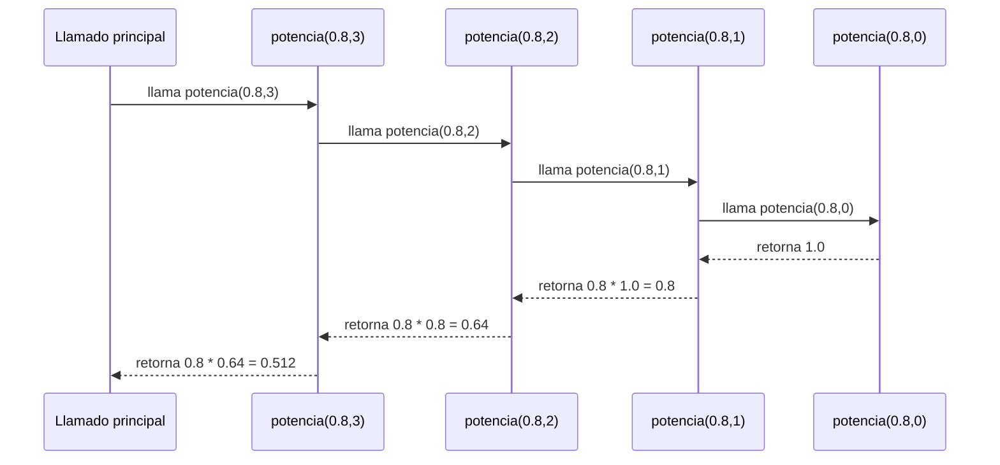

# 📝 Informe de la función `grande`

---

## 🧩 Descripción

El conjunto difuso de números grandes se define con la siguiente expresión:

$$
f(n) = \left(\frac{n}{n + d}\right)^e
$$

Donde $d \ge 1$ y $e > 1$.  
A medida que $n$ crece, el valor de $f(n)$ se aproxima a $1$, lo que indica que el número se considera más “grande”.

---

## ⚙️ Implementación

```scala
def grande(d: Int, e: Int): ConjDifuso = {
  def potencia(base: Double, exp: Int): Double =
    if (exp == 0) 1.0 else base * potencia(base, exp - 1)

  (n: Int) => {
    if (n <= 0) 0.0
    else {
      val base = n.toDouble / (n + d).toDouble
      potencia(base, e)
    }
  }
}
```

---

## 🔁 Pila de llamados — función `potencia`

Ejemplo: calcular `potencia(0.8, 3)`


**Resultado final:**
$$0.8^3 = 0.512$$

---

### 🧪 **Casos de prueba**

| n    | Resultado esperado (aprox) | Descripción                            |
|------|-----------------------------|----------------------------------------|
| -5   | 0.0                         | Valor negativo no se considera grande  |
| 0    | 0.0                         | Cero no se considera grande            |
| 1    | $0 < f(1) < 1$              | Valor pequeño                          |
| 10   | $f(10) > f(5)$              | A mayor número, mayor grado            |
| 1000 | $f(1000) \approx 1$         | Valor muy grande                       |

---

## 🧠 Conclusión

La función `grande` define correctamente un conjunto difuso que asigna valores de pertenencia crecientes a medida que el número aumenta.

El comportamiento verificado coincide con la teoría:

cuando $n$ crece,

$$
f(n) = \left(\frac{n}{n + d}\right)^e
$$

tiende a $1$, lo que significa que el número es cada vez más “grande” dentro del conjunto difuso.

