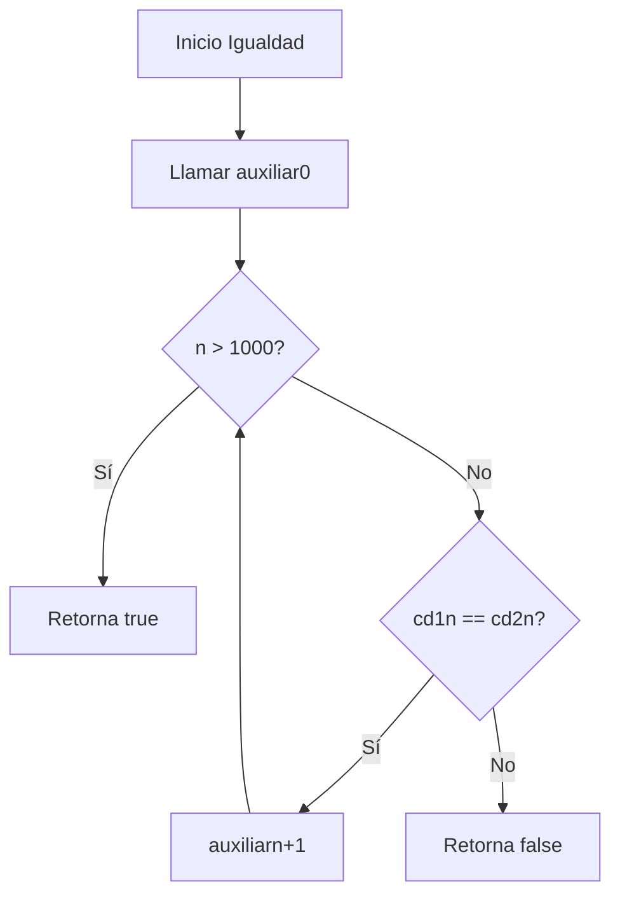
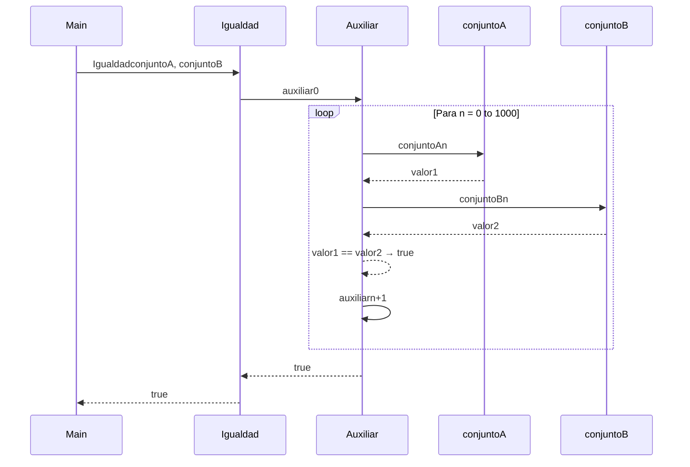

# Igualdad de Conjuntos Difusos

---

## 1. Definición matemática

Dados $S_1, S_2 \subseteq U$ con funciones de pertenencia:
$$f_{S_1}, f_{S_2}: U \to [0,1]$$

Se dice que ambos conjuntos son **iguales** si cumplen:
$$S_1 = S_2 \quad \Leftrightarrow \quad S_1 \subseteq S_2 \ \wedge\ S_2 \subseteq S_1$$

En términos de sus funciones de pertenencia:
$$f_{S_1}(x) = f_{S_2}(x), \quad \forall x \in U$$

Como no es posible evaluar infinitos elementos, se restringe el universo a:
$$U = \{0, 1, 2, \dots, 1000\}$$

Por tanto, dos conjuntos difusos son iguales si:
$$\forall x \in [0,1000],\ f_{S_1}(x) = f_{S_2}(x)$$

---

## 2. Implementación en Scala

```scala
def igualdad(cd1: ConjDifuso, cd2: ConjDifuso): Boolean = {
  @tailrec
  def auxiliar(n: Int): Boolean = {
    if (n > 1000) true
    else if (cd1(n) == cd2(n)) auxiliar(n + 1)
    else false
  }

  auxiliar(0)
}
```

### Explicación:

- Recursión de cola: La función auxiliar realiza una recursión optimizada que no acumula frames en la pila.


- Caso base: Cuando n > 1000, retorna true (todos los elementos verificados son iguales).


- Caso recursivo: Si cd1(n) == cd2(n), continúa con n + 1.


- Corte temprano: Si encuentra un elemento donde difieren, retorna false inmediatamente.

---

## 3. Ejemplo paso a paso
   
Definimos dos conjuntos difusos:

```scala
val conjuntoA: ConjDifuso = {
case 1 => 0.2
case 2 => 0.5
case 3 => 0.8
case 4 => 1.0
case _ => 0.0
}

val conjuntoB: ConjDifuso = {
case 1 => 0.2
case 2 => 0.5
case 3 => 0.8
case 4 => 1.0
case _ => 0.0
} 
```

Ejecución de Igualdad(conjuntoA, conjuntoB):


| Paso | $n$   | $f_A(n)$ | $f_B(n)$ | Acción        |
|------|-------|----------|----------|---------------|
| 1    | 0     | 0.0      | 0.0      | auxiliar(1)   |
| 2    | 1     | 0.2      | 0.2      | auxiliar(2)   |
| 3    | 2     | 0.5      | 0.5      | auxiliar(3)   |
| 4    | 3     | 0.8      | 0.8      | auxiliar(4)   |
| 5    | 4     | 1.0      | 1.0      | auxiliar(5)   |
| ...  | ...   | ...      | ...      | ...           |
|1002  |1001   | -        | -        | true          |

Resultado final: true

---

## 4. Casos de prueba y explicación
   
Se implementaron 7 pruebas unitarias con ScalaTest.
Cada caso evalúa un comportamiento distinto de la función Igualdad.

---

### Caso 1 — Igualdad de dos conjuntos difusos
**Entrada:** conjuntoA, conjuntoB

**Resultado esperado:** true

**Explicación:** Todos los grados son idénticos → conjuntos iguales.

---

### Caso 2 — Igualdad con conjunto vacío
**Entrada:** conjuntoA, conjuntoVacio(x) = 0.0

**Resultado esperado:** false

**Explicación:** En $n = 1$, $f_A(1) = 0.2 \neq 0.0$ → corte temprano.

---

### Caso 3 — Conjuntos con diferentes grados
**Entrada:** conjuntoA, conjuntoC donde $f_C(1) = 0.3 $

**Resultado esperado:** false

**Explicación:** En $n = 1$, $0.2 \neq 0.3$ → retorna false inmediatamente.

---

### Caso 4 — Conjuntos idénticos
**Entrada:** conjuntoA, conjuntoA

**Resultado esperado:** true

**Explicación:** Propiedad reflexiva → recursión completa hasta 1001.

---

### Caso 5 — Conjuntos con solapamiento parcial
**Entrada:** conjuntoA, conjuntoD (solo comparten algunos elementos)

**Resultado esperado:** false

**Explicación:** Difieren en al menos un elemento del rango [0,1000].

---

### Caso 6 — Conjuntos iguales excepto en un punto
**Entrada:** Dos conjuntos que difieren solo en $x = 500 $

**Resultado esperado:** false

**Explicación:** Corte en $n = 500 $ cuando detecta la diferencia.

---

### Caso 7 — Conjuntos definidos por tramos
**Entrada:** $f_A(x) = f_B(x) = 0.5$ para $0 \le x \le 1000$

**Resultado esperado:** true

**Explicación:** Recorre todo el rango sin encontrar diferencias.

---

## 5. Diagramas de ejecución
   
Diagrama de flujo — función Igualdad


Diagrama de secuencia — Ejemplo para conjuntos iguales



---


## 6. Estado de la pila de llamados

**Caso:** conjuntos iguales

```text
Igualdad(conjuntoA, conjuntoB)
└── auxiliar(0)
    ├── cd1(0) = 0.0, cd2(0) = 0.0 → iguales
    └── auxiliar(1)
        ├── cd1(1) = 0.2, cd2(1) = 0.2 → iguales
        └── auxiliar(2)
            ├── cd1(2) = 0.5, cd2(2) = 0.5 → iguales
            └── auxiliar(3)
                ├── cd1(3) = 0.8, cd2(3) = 0.8 → iguales
                └── auxiliar(4)
                    └── ... (continúa hasta 1001)
                        └── auxiliar(1001)
                            └── n > 1000 → retorna true
```

**Caso:** conjuntos diferentes en n=2

```text
Igualdad(conjuntoA, conjuntoC)
└── auxiliar(0)
    ├── cd1(0) = 0.0, cd2(0) = 0.0 → iguales
    └── auxiliar(1)
        ├── cd1(1) = 0.2, cd2(1) = 0.2 → iguales
        └── auxiliar(2)
            ├── cd1(2) = 0.5, cd2(2) = 0.4 → diferentes
            └── retorna false
```
