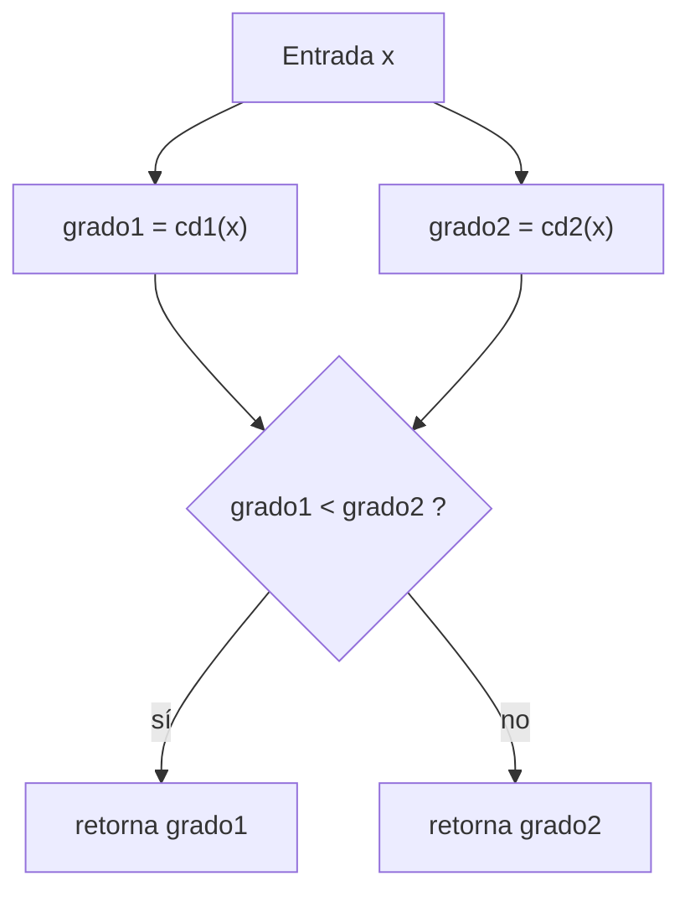
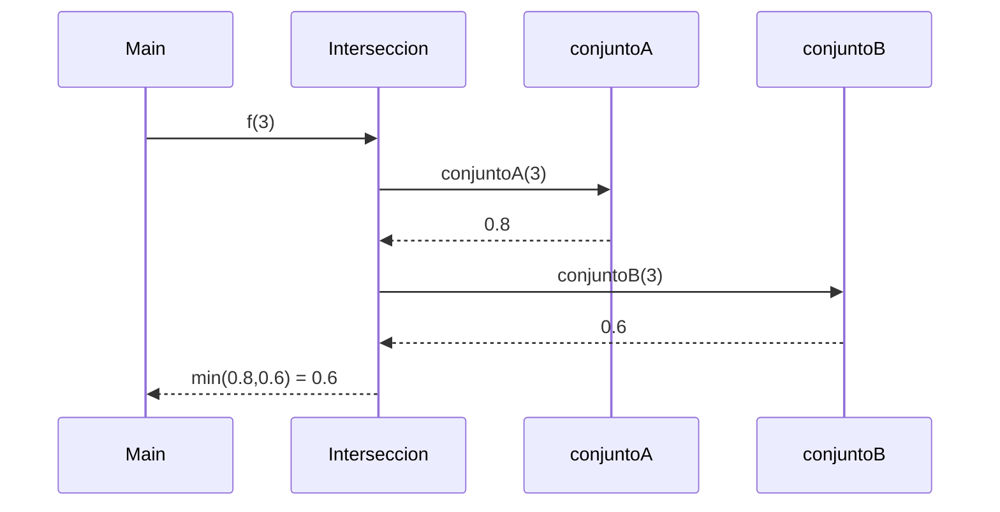

# Intersección de Conjuntos Difusos


---

## 1. Definición matemática

Dados $$S_1, S_2 \subseteq U$$ con funciones de pertenencia:
$$f_{S_1}, f_{S_2}: U \to [0,1]$$

La intersección difusa se define como:

$$f_{S_1 \cap S_2}(x) = \min\big(f_{S_1}(x), f_{S_2}(x)\big),\qquad \forall x\in U$$

**Propiedades principales:**
- Conmutativa:  $$f_{S_1 \cap S_2}(x) = f_{S_2 \cap S_1}(x)$$
- Idempotente:  
  $$f_{S \cap S}(x) = f_S(x)$$
- Limitada por el mínimo de pertenencias.

---

## 2. Implementación en Scala

```scala
def interseccion(cd1: ConjDifuso, cd2: ConjDifuso): ConjDifuso = {
  (x: Int) => {
    val grado1 = cd1(x)
    val grado2 = cd2(x)
    if (grado1 < grado2) grado1 else grado2
  }
}
```
Explicación:

- Un conjunto difuso se representa como una función Int => Double.


- La función interseccion devuelve otra función que evalúa, para cada elemento
𝑥, el mínimo de los dos grados de pertenencia.


- El bloque if (grado1 < grado2) grado1 else grado2.
Lo que hace es comparar los dos valores y retornar el menor de ellos, ya que este es el que pertenece a ambos.

---

## 3. Ejemplo paso a paso

Definimos dos conjuntos difusos:

```Scala 
val conjuntoA: objConjuntosDifusos.ConjDifuso = {
  case 1 => 0.2;
  case 2 => 0.5;
  case 3 => 0.8;
  case 4 => 1.0;
  case _ => 0.0
}

val conjuntoB: objConjuntosDifusos.ConjDifuso = {
  case 3 => 0.6;
  case 4 => 0.9;
  case 5 => 1.0;
  case _ => 0.0
}
```
### Evaluación manual

- Para \(x = 1\):  
  $$f_A(1) = 0.2, \quad f_B(1) = 0.0 \quad \Rightarrow \quad f_{A \cap B}(1) = 0.0$$

- Para \(x = 3\):  
  $$f_A(3) = 0.8, \quad f_B(3) = 0.6 \quad \Rightarrow \quad f_{A \cap B}(3) = 0.6$$

- Para \(x = 4\):  
  $$f_A(4) = 1.0, \quad f_B(4) = 0.9 \quad \Rightarrow \quad f_{A \cap B}(4) = 0.9$$

- Para \(x = 5\):  
  $$f_A(5) = 0.0, \quad f_B(5) = 1.0 \quad \Rightarrow \quad f_{A \cap B}(5) = 0.0$$

---

## 4. Casos de prueba y explicación

Se implementaron **7 pruebas unitarias** con ScalaTest. A continuación la explicación de cada caso.

---

### Caso 1 — Intersección de dos conjuntos difusos
- **Entrada:** `conjuntoA`, `conjuntoB`.
- **Resultados esperados:**
  $$f(1)=0.0, \quad f(3)=0.6, \quad f(4)=0.9, \quad f(5)=0.0$$
- **Válida:** comportamiento normal cuando hay elementos comunes.

---

### Caso 2 — Intersección con conjunto vacío
- **Entrada:** `conjuntoA`, `conjuntoVacio(x)=0.0`.
- **Resultado esperado:**
  $$f(x)=0.0 \quad \forall x$$
- **Valida:** propiedad $$S \cap \varnothing = \varnothing$$.

---

### Caso 3 — Intersección de conjuntos idénticos
- **Entrada:** `conjuntoA`, `conjuntoA`.
- **Resultado esperado:**
  $$f_{A \cap A}(x) = f_A(x)$$
- **Ejemplo:**
  $$f(2)=0.5, \quad f(4)=1.0$$
- **Válida:** propiedad idempotente.

---

### Caso 4 — Intersección sin solapamiento
- **Entrada:** `conjuntoA`, `conjuntoC` (definido solo en \(x=6,7\)).
- **Resultado esperado:**
  $$f(x)=0.0 \quad \forall x$$
- **Válida:** intersección vacía si no existen elementos comunes.

---

### Caso 5 — Intersección parcialmente solapada
- **Entrada:** `conjuntoA`, `conjuntoD` con valores en \(2,3,4\).
- **Resultados esperados:**
  $$f(2)=\min(0.5,0.3)=0.3, \quad f(3)=0.7, \quad f(4)=0.5$$
- **Valida:** se calcula correctamente el mínimo en elementos comunes.

---

### Caso 6 — Intersección de conjuntos con diferentes rangos

- **Entrada:** `conjuntoA` (elementos 1–4) y `conjuntoE` (elementos 10, 20).
- **Resultados esperados:**
    $$f(1) = 0.0, f(3) = 0.0, f(10) = 0.0, f(20) = 0.0$$
- **Válida:** intersección vacía cuando no hay elementos comunes.

---

### Caso 7 — Intersección con valores límite
- **Entrada:** conjuntoA y conjuntoF (elementos extremos 0 y 1000).

- **Resultados esperados:**

$$f(0) = 0.0, f(1) = 0.0, f(1000) = 0.0$$

- **Válida:** manejo correcto de valores en los límites del universo.

---

## 5. Diagramas de ejecución

Diagrama de flujo (cómo funciona la intersección)



Diagrama de secuencia (ejemplo para x=3)


